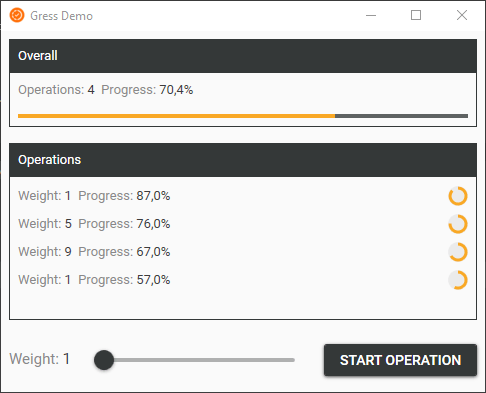

# Gress

[](https://github.com/Tyrrrz/Gress/actions)
[](https://codecov.io/gh/Tyrrrz/Gress)
[](https://nuget.org/packages/Gress)
[](https://nuget.org/packages/Gress)
[](https://tyrrrz.me/donate)

Gress is a library that makes progress reporting and aggregation easier. It exposes a well-known interface for individual operations to report progress, routing it to an aggregator. Applications can display the aggregated progress to inform users about overall completion of a set of operations.

## Download

- [NuGet](https://nuget.org/packages/Gress): `dotnet add package Gress`

## Features

- Manages and aggregates progress from multiple operations
- Supports weighted operations
- Implements `INotifyPropertyChanged`
- Implements `IProgress<double>`
- Targets .NET Framework 4.5+ and .NET Standard 1.0+
- No external dependencies

## Screenshots



## Usage

### Basic example

Progress is reported using the `Report()` method.
When an instance of `ProgressOperation` is disposed, it's marked as completed and cannot report progress anymore.

```c#
var manager = new ProgressManager();

// Create an operation and execute a long-running process
using (var operation = manager.CreateOperation())
{
    for (var i = 0; i < 100; i++)
    {
        await Task.Delay(200); // simulate time-consuming task
        operation.Report((i+1)/100); // report progress
    }
}
```

### Using weight

Operations may have custom weight which defines how much its own progress affects the total progress, compared to other operations.
This is useful, for example, when you know that one of the operations takes less time to complete and want to make total progress look a bit more linear.

```c#
var manager = new ProgressManager();

// Create a light operation
var operationLight = manager.CreateOperation(1);

// Create a heavy operation
var operationHeavy = manager.CreateOperation(5);

// Report progress on both
operationLight.Report(0.8); // 80%
operationHeavy.Report(0.4); // 40%

// Print total progress
Console.WriteLine(manager.Progress); // 0.46667 (~47%)
```

### Pre-creating operations

Often you may need to pre-create operations in cases where the number of operations is known ahead of time and you want `ProgressManager` to account for them when calculating aggregated progress.

```c#
var manager = new ProgressManager();

// Create 2 operations
var operations = manager.CreateOperations(2);

// Perform first operation (from 0% to 50%)
using (var operation = operations[0])
    ExecuteLongRunningProcess(operation);

// Perform second operation (from 50% to 100%)
using (var operation = operations[1])
    ExecuteOtherLongRunningProcess(operation);
```

### Integrating with other code

The standard guideline for reporting progress in .NET is to use an instance of `System.IProgress<T>`.

Since Gress represents progress as `double`, the `ProgressOperation` class also implements `IProgress<double>`.
If you have existing code or 3rd-party libraries that report progress using `IProgress<double>` then you can simply use `ProgressOperation` as the corresponding parameter.

Here's an example that uses [YoutubeExplode](https://github.com/Tyrrrz/YoutubeExplode) and Gress to download a YouTube video and report progress.

```c#
var youtubeClient = new YoutubeClient();
var progressManager = new ProgressManager();

using (var operation = progressManager.CreateOperation())
{
    // Get stream info
    var streamInfoSet = await youtubeClient.GetVideoMediaStreamInfosAsync("9bZkp7q19f0")
    var streamInfo = streamInfoSet.Muxed.WithHighestVideoQuality();

    // Download stream (operation here is passed as IProgress<double>)
    await youtubeClient.DownloadMediaStreamAsync(streamInfo, "ouput.bin", operation);
}
```

### Integrating with XAML

Both `ProgressManager` and `ProgressOperation` implement `INotifyPropertyChanged` so corresponding bound properties will be automatically refreshed every time progress changes.

The following is a rough example of how `ProgressManager` can be used in WPF.

```c#
public class MainViewModel
{
    public IProgressManager ProgressManager { get; } = new ProgressManager();
    public ICommand ExecuteOperationCommand { get; }

    public MainViewModel()
    {
        ExecuteOperationCommand = new RelayCommand(ExecuteOperation);
    }

    public async void ExecuteOperation()
    {
        using (var operation = ProgressManager.CreateOperation())
        {
            for (var i = 0; i < 100; i++)
            {
                await Task.Delay(200); // simulate time-consuming task
                operation.Report((i+1)/100); // report progress
            }
        }
    }
}
```

```xml
<Window
    x:Class="MainWindow"
    xmlns="http://schemas.microsoft.com/winfx/2006/xaml/presentation"
    xmlns:x="http://schemas.microsoft.com/winfx/2006/xaml"
    xmlns:d="http://schemas.microsoft.com/expression/blend/2008"
    d:DataContext="{d:DesignInstance Type=MainViewModel}">
    <StackPanel>
        <!-- Button that starts a new operation -->
        <Button Margin="32" Content="Execute" Command="{Binding ExecuteOperationCommand}" />

        <!-- Progress bar that shows total progress -->
        <ProgressBar Margin="32" Height="10" Minimum="0" Maximum="1" Value="{Binding ProgressManager.Progress, Mode=OneWay}" />
    </StackPanel>
</Window>
```

## Libraries used

- [PropertyChanged.Fody](https://github.com/Fody/PropertyChanged)
- [GalaSoft.MVVMLight](http://www.mvvmlight.net)
- [MaterialDesignInXamlToolkit](https://github.com/ButchersBoy/MaterialDesignInXamlToolkit)
- [NUnit](https://github.com/nunit/nunit)
- [Coverlet](https://github.com/tonerdo/coverlet)