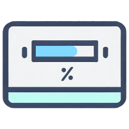
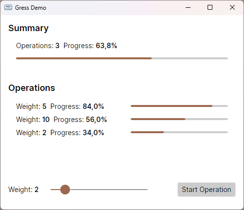

# Gress

[](https://github.com/Tyrrrz/.github/blob/master/docs/project-status.md)
[](https://tyrrrz.me/ukraine)
[](https://github.com/Tyrrrz/Gress/actions)
[](https://codecov.io/gh/Tyrrrz/Gress)
[](https://nuget.org/packages/Gress)
[](https://nuget.org/packages/Gress)
[](https://discord.gg/2SUWKFnHSm)
[](https://twitter.com/tyrrrz/status/1495972128977571848)

<table>
    <tr>
        <td width="99999" align="center">Development of this project is entirely funded by the community. <b><a href="https://tyrrrz.me/donate">Consider donating to support!</a></b></td>
    </tr>
</table>

<p align="center">
    
</p>

**Gress** is a library that extends the standard [`IProgress<T>`](https://docs.microsoft.com/en-us/dotnet/api/system.iprogress-1) interface with a set of utilities for collecting, transforming, filtering, and multiplexing progress updates in your code.

## Terms of use<sup>[[?]](https://github.com/Tyrrrz/.github/blob/master/docs/why-so-political.md)</sup>

By using this project or its source code, for any purpose and in any shape or form, you grant your **implicit agreement** to all the following statements:

- You **condemn Russia and its military aggression against Ukraine**
- You **recognize that Russia is an occupant that unlawfully invaded a sovereign state**
- You **support Ukraine's territorial integrity, including its claims over temporarily occupied territories of Crimea and Donbas**
- You **reject false narratives perpetuated by Russian state propaganda**

To learn more about the war and how you can help, [click here](https://tyrrrz.me/ukraine). Glory to Ukraine! 🇺🇦

## Install

- 📦 [NuGet](https://nuget.org/packages/Gress): `dotnet add package Gress`

## Screenshots



## Usage

### Percentage type

To make progress updates more explicit, **Gress** provides a universal progress unit — the `Percentage` type.
Unlike the primitive numeric types that are commonly paired with `IProgress<T>`, this type can be used to unambiguously represent progress as a ratio of completed work to the total amount of work encapsulated by a given operation.

An instance of `Percentage` can be created from either a value or a fraction:

```csharp
using Gress;

// Mapped from value
var fiftyPercent = Percentage.FromValue(50); // 50%

// Mapped from fractional representation
var twentyPercent = Percentage.FromFraction(0.2); // 20%
```

Similarly, both value and fraction can be extracted from an initialized `Percentage` by accessing the corresponding properties:

```csharp
using Gress;

var fiftyPercent = Percentage.FromValue(50);

var asValue = fiftyPercent.Value; // 50.0 (double)
var asFraction = fiftyPercent.Fraction; // 0.5 (double)
```

Using `Percentage` in your `IProgress<T>` handlers lets you communicate progress updates without making any assumptions about their semantics:

```csharp
using Gress;

async Task PerformWorkAsync(IProgress<Percentage> progrss)
{
    await Task.Delay(100);

    // Half-way done
    progress.Report(Percentage.FromValue(50));

    await Task.Delay(100);

    // Finished
    progress.Report(Percentage.FromFraction(1));
}

// ...

var progress = new Progress<Percentage>(p => Console.WriteLine(p));
await PerformWorkAsync(progress);

// Console output:
// 50,0%
// 100,0%
```

When interfacing with external methods, however, you may need to provide a specific progress handler required by their signature.
In such cases, you can convert an existing percentage-based handler into another type using one of the available extension methods:

```csharp
using Gress;

async Task FooAsync(IProgress<double> progress) { /* ... */ }
async Task BarAsync(IProgress<int> progress) { /* ... */ }

var progress = new Progress<Percentage>(p => /* ... */);

await FooAsync(progress.ToDoubleBased());
await BarAsync(progress.ToInt32Based());
```

Likewise, you can also perform conversions in the other direction, which can be useful for preserving backwards-compatibility in your own methods:

```csharp
using Gress;

async Task FooAsync(IProgress<double> progress)
{
    var actualProgress = progress.ToPercentageBased(); // IProgress<Percentage>

    // Reports 0.5 on the original progress handler
    actualProgress.Report(Percentage.FromFraction(0.5));
}

async Task BarAsync(IProgress<int> progress)
{
    var actualProgress = progress.ToPercentageBased(); // IProgress<Percentage>

    // Reports 50 on the original progress handler
    actualProgress.Report(Percentage.FromFraction(0.5));
}
```

> **Note**:
> When converting between percentage-based and double-based handlers, percentages are mapped using their fractional form by default.
> To override this behavior and map by value instead, use `ToDoubleBased(asFraction: false)` and `ToPercentageBased(asFraction: false)`.

> **Note**:
> For more complex conversion scenarios, consider using the [`WithTransform(...)`](#transformation) method.

### Terminal handlers

Every progress reporting chain ultimately ends with a terminal handler, which usually relays the information to the user or stores it somewhere else.
To simplify some of the most common scenarios, **Gress** comes with two terminal handlers built in.

#### Progress container

This handler is an object with a single property, whose value is overwritten with every new progress update that gets reported.
It also implements the `INotifyPropertyChanged` interface, allowing the property to be bound from XAML-based user interfaces.

Here's a very basic example of how you would use it in a typical WPF application:

```csharp
public class MainViewModel
{
    public MainViewModel() =>
        PerformWorkCommand = new AsyncRelayCommand(PerformWorkAsync);

    public ProgressContainer<Percentage> Progress { get; } = new();

    public IRelayCommand PerformWorkCommand { get; }

    public async Task PerformWorkAsync()
    {
        for (var i = 1; i <= 100; i++)
        {
            // Simulate work
            await Task.Delay(200);
            
            // Report progress as a value in the 0..100 range
            Progress.Report(Percentage.FromValue(i));
        }    
    }
}
```

```xml
<Window
    x:Class="MainWindow"
    xmlns="http://schemas.microsoft.com/winfx/2006/xaml/presentation"
    xmlns:x="http://schemas.microsoft.com/winfx/2006/xaml"
    xmlns:d="http://schemas.microsoft.com/expression/blend/2008"
    d:DataContext="{d:DesignInstance Type=MainViewModel}">
    <StackPanel>
        <Button
            Margin="32"
            Content="Execute"
            Command="{Binding PerformWorkCommand}" />

        <ProgressBar
            Margin="32"
            Height="10"
            Minimum="0"
            Maximum="100"
            Value="{Binding Progress.Current.Value, Mode=OneWay}" />
    </StackPanel>
</Window>
```

#### Progress collector

This handler works by storing all reported progress updates in a collection, whose values can be retrieved later.
It's primarily designed for testing purposes.

Here's how you can use it to verify that a method reported its progress correctly:

```csharp
[Fact]
public async Task My_method_reports_progress_correctly()
{
    // Arrange
    var progress = new ProgressCollector<Percentage>();
    var worker = new Worker();

    // Act
    await worker.PerformWorkAsync(progress);

    // Assert
    var values = progress.GetValues();

    values.Should().NotBeEmpty(); // not empty
    values.Should().OnlyHaveUniqueItems(); // no redundant updates
}
```

### Composing handlers

Existing progress handlers can be composed into more complex handlers using some of the extension methods that **Gress** offers.
These can be used to easily apply transformations, inject filtering logic, or merge multiple handlers together.

#### Transformation

You can use `WithTransform(...)` to create a handler that transforms all reported progress updates into a different form:

```csharp
using Gress;

enum Status { Started, HalfWay, Completed }

var progress = new Progress<Percentage>(p => /* ... */);

// Transform into a progress handler that accepts an enum value and maps
// it into a value of the original type
var transformedProgress = progress.WithTransform((Status s) => s switch
{
    Status.Completed => Percentage.FromValue(100), // 100%
    Status.HalfWay => Percentage.FromValue(50), // 50%
    _ => Percentage.FromValue(0) // 0%
}); // IProgress<Status>

// Effectively reports 50% on the original handler
transformedProgress.Report(Status.HalfWay);
```

A simpler overload of the above method can also be used when transforming between values of the same type:

```csharp
using Gress;

var progress = new Progress<int>(p => /* ... */);

var transformedProgress = progress.WithTransform(p => 5 * p); // IProgress<int>

// Effectively reports 50% on the original handler
transformedProgress.Report(10);
```

> **Note**:
> Method `WithTransform(...)` bears some resemblance to LINQ's `Select(...)`, however they are not completely equivalent.
> The main difference is that the flow of data in `IProgress<T>` is inverse to that of `IEnumerable<T>`, which means that the transformations in `WithTransform(...)` are applied in the opposite direction.

#### Filtering

You can use `WithFilter(...)` to create a handler that drops progress updates that don't satisfy a predicate:

```csharp
using Gress;

var progress = new Progress<Percentage>(p => /* ... */);

// Filter out values below 10%
var filteredProgress = progress.WithFilter(p => p.Fraction >= 0.1);

filteredProgress.Report(Percentage.FromFraction(0.05)); // ✖
filteredProgress.Report(Percentage.FromFraction(0.25)); // ✓
```

#### Deduplication

You can use `WithDeduplication(...)` to create a handler that filters out consecutive progress updates with the same value:

```csharp
using Gress;

var progress = new Progress<Percentage>(p => /* ... */);

var deduplicatedProgress = progress.WithDeduplication();

deduplicatedProgress.Report(Percentage.FromFraction(0.1)); // ✓
deduplicatedProgress.Report(Percentage.FromFraction(0.3)); // ✓
deduplicatedProgress.Report(Percentage.FromFraction(0.3)); // ✖
deduplicatedProgress.Report(Percentage.FromFraction(0.3)); // ✖
deduplicatedProgress.Report(Percentage.FromFraction(0.5)); // ✓
```

#### Ordering

You can use `WithOrdering(...)` to create a handler that filters out progress updates that arrive out of order:

```csharp
using Gress;

var progress = new Progress<Percentage>(p => /* ... */);

var orderedProgress = progress.WithOrdering();

orderedProgress.Report(Percentage.FromFraction(0.1)); // ✓
orderedProgress.Report(Percentage.FromFraction(0.3)); // ✓
orderedProgress.Report(Percentage.FromFraction(0.2)); // ✖
orderedProgress.Report(Percentage.FromFraction(0.5)); // ✓
orderedProgress.Report(Percentage.FromFraction(0.4)); // ✖
```

#### Merging

You can use `Merge(...)` to combine multiple progress handlers into one:

```csharp
using Gress;

var progress1 = new Progress<Percentage>(p => /* ... */);
var progress2 = new Progress<Percentage>(p => /* ... */);

var mergedProgress = progress1.Merge(progress2); // IProgress<Percentage>

// Reports 50% on both progress handlers
mergedProgress.Report(Percentage.FromFraction(0.5));
```

This method can also be called on collections:

```csharp
using Gress;

var progresses = new[]
{
    new Progress<Percentage>(p => /* ... */),
    new Progress<Percentage>(p => /* ... */),
    new Progress<Percentage>(p => /* ... */),
    new Progress<Percentage>(p => /* ... */)
};

var mergedProgress = progresses.Merge(); // IProgress<Percentage>

// Reports 50% on all progress handlers
mergedProgress.Report(Percentage.FromFraction(0.5));
```

### Multiplexing

Multiplexing allows a single handler to aggregate progress updates from multiple input sources.
This is useful when you want to encapsulate several progress-reporting operations in a single higher-order operation.

To do this, create a muxer for the target progress handler and then use it to assign an input for each operation:

```csharp
using Gress;

var progress = new Progress<Percentage>(p => /* ... */);

var muxer = progress.CreateMuxer();
var subProgress1 = muxer.CreateInput(); // IProgress<Percentage>
var subProgress2 = muxer.CreateInput(); // IProgress<Percentage>
var subProgress3 = muxer.CreateInput(); // IProgress<Percentage>
```

When a progress update is reported on any of these inputs, all the updates up to that point are aggregated into one and routed to the target handler.
The sample below illustrates this process in detail:

```csharp
// ...

subProgress1.Report(Percentage.FromFraction(0.5));

// Input 1 ->  50%
// Input 2 ->   0%
// Input 3 ->   0%
// Total   -> ~17%

subProgress1.Report(Percentage.FromFraction(1));
subProgress2.Report(Percentage.FromFraction(0.75));

// Input 1 -> 100%
// Input 2 ->  75%
// Input 3 ->   0%
// Total   -> ~58%

subProgress2.Report(Percentage.FromFraction(1));
subProgress3.Report(Percentage.FromFraction(0.9));

// Input 1 -> 100%
// Input 2 -> 100%
// Input 3 ->  90%
// Total   -> ~97%

subProgress3.Report(Percentage.FromFraction(1));

// Input 1 -> 100%
// Input 2 -> 100%
// Input 3 -> 100%
// Total   -> 100%
```

Additionally, since muxer inputs are progress handlers themselves, they can be multiplexed further as well.
Doing this allows you to create hierarchical progress reporting chains:

```csharp
using Gress;

async Task PerformWorkAsync(IProgress<Percentage> progress)
{
    for (var i = 1; i <= 100; i++)
    {
        await Task.Delay(200);
        progress.Report(Percentage.FromValue(i));
    }
}

async Task FooAsync(IProgress<Percentage> progress)
{
    var muxer = progress.CreateMuxer();
    var subProgress1 = muxer.CreateInput();
    var subProgress2 = muxer.CreateInput();

    await Task.WhenAll(
        PerformWorkAsync(subProgress1),
        PerformWorkAsync(subProgress2)
    );
}

async Task BarAsync(IProgress<Percentage> progress)
{
    var muxer = progress.CreateMuxer();
    var subProgress1 = muxer.CreateInput();
    var subProgress2 = muxer.CreateInput();
    var subProgress3 = muxer.CreateInput();

    await Task.WhenAll(
        FooAsync(subProgress1),
        FooAsync(subProgress2),
        FooAsync(subProgress3)
    );
}
```

> **Note**:
> Muxing is only available on percentage-based handlers because it relies on their ability to represent progress as a relative fraction.
> If required, you can convert certain other handlers into percentage-based handlers using the `ToPercentageBased()` extension method.

#### Custom weights

A muxer input may be assigned a custom weight modifier, which determines its priority in relation to others.
Progress reported on an input with higher weight influences the aggregated progress to a greater degree and vice versa.

You can specify the input weight by passing it to the `CreateInput(...)` method:

```csharp
using Gress;

var progress = new Progress<Percentage>(p => /* ... */);

var muxer = progress.CreateMuxer();
var subProgress1 = muxer.CreateInput(1);
var subProgress2 = muxer.CreateInput(4);

// Weight split:
// Input 1 -> 20% of total
// Input 2 -> 80% of total

subProgress1.Report(Percentage.FromFraction(0.9));
subProgress2.Report(Percentage.FromFraction(0.3));

// Input 1 -> 90% (less important)
// Input 2 -> 30% (more important)
// Total   -> 42% (would've been 60% without weights)
```

#### Auto-reset muxer

In some cases, you may need to report progress on an infinite workflow where new operations are started and completed in a continuous fashion.
This can be achieved by using an auto-reset muxer.

Inputs to an auto-reset muxer implement the `ICompletableProgress<T>` interface and are capable of reporting completion after all of the underlying work is finished.
Once all connected inputs report completion, they are disconnected from the muxer and the latter is reset back to the initial state.

To create an auto-reset muxer, call `WithAutoReset()` on an existing instance:

```csharp
using Gress;
using Gress.Completable;

var progress = new Progress<Percentage>(p => /* ... */);

var muxer = progress.CreateMuxer().WithAutoReset();
var subProgress1 = muxer.CreateInput(); // ICompletableProgress<Percentage>
var subProgress2 = muxer.CreateInput(); // ICompletableProgress<Percentage>

subProgress1.Report(Percentage.FromFraction(0.3));
subProgress2.Report(Percentage.FromFraction(0.9));

// Input 1 -> 30%
// Input 2 -> 90%
// Total   -> 60%

subProgress1.Report(Percentage.FromFraction(1));
subProgress1.ReportCompletion();

// Input 1 -> 100% (completed)
// Input 2 -> 90%
// Total   -> 95%

subProgress2.Report(Percentage.FromFraction(1));
subProgress2.ReportCompletion();

// All inputs disconnected
// Total   -> 0%

var subProgress3 = muxer.CreateInput();
subProgress3.Report(Percentage.FromFraction(0.5));

// Input 3 -> 50%
// Total   -> 50%
```

> **Note**:
> You can wrap an instance of `ICompletableProgress<T>` in a disposable container by calling `ToDisposable()`.
> This allows you to place the handler in a `using (...)` block, which ensures that the completion is always reported at the end.